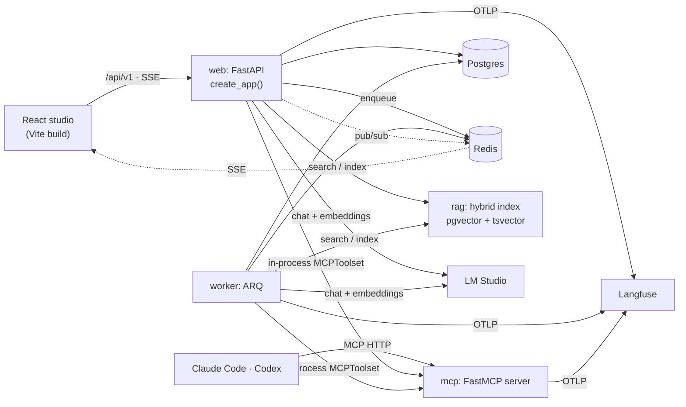

# Architecture

## Processes

| Process | Entry point | Job |
|---|---|---|
| web | `python -m draftpilot.api` → `api/app.py:create_app` | The REST API under `/api/v1`, streamed room chat, SSE live sync, and serving `frontend/dist` |
| worker | `arq draftpilot.worker.settings.WorkerSettings` | Durable runs: room workflows, context workflows, evaluations, RAG indexing, Story-twin refresh, Langfuse scores |
| mcp | `fastmcp run src/draftpilot/mcp/server.py:mcp --transport http` (stdio: `python -m draftpilot.mcp`) | The one tool surface, shared by external agents and the in-app room |
| rag | `uvicorn draftpilot.rag_service:app` | A replaceable hybrid-retrieval service: pgvector HNSW and tsvector GIN, fused with RRF |

### Serving the studio

The web process serves the React build with FastAPI's `app.frontend("/", fallback="index.html")`.
Frontend routes have low priority, so every API route, the SSE stream and `/health` match first.
A browser deep link (`Accept: text/html`) gets `index.html`, while a missing asset, a POST to an
unknown path, and any unmatched `/api/*` GET return 404. Hashed files under `/assets/` are sent
with `Cache-Control: immutable`, and the HTML shell with `no-cache`, so a new build takes effect on
the next load.

Auth is on the `/api/v1` router, not the app, so the shell and its token prompt load without
credentials. MCP runs as its own service with its own bearer auth.

`Dockerfile.ui` builds `frontend/` in a Node stage and copies `frontend/dist` into the image at
`WEB__FRONTEND_DIST` (default `/app/frontend/dist`). The image sets `WEB__REQUIRE_FRONTEND=true`,
so the web process refuses to start without a build. Local runs, tests and `compose.dev.yml` (which
bind-mounts the host's `frontend/dist`) leave it `false`, and the API serves without a build.

## Data

The screenplay hierarchy is Project → Screenplay (a draft) → Act → Scene → Block. A block is one typed
screenplay element and carries an `origin` (`human`, `import` or `proposal:<id>`), which drives
retention metrics. Scenes carry a `version` for optimistic concurrency. The hydration layer
(`core/screenplay/hydrate.py`) translates between these rows and a `ScreenplayDoc`, keeping block ids
stable. Import, export, snapshots and scene rewrites all build on it.

Around the script:

- story artifacts (brief, outline, characters and so on);
- the knowledge graph, which also holds the Story twin's nodes;
- the Writer twin (`writer_profile`, `writer_memory`);
- the audit trail: proposals, workflow runs, agent runs, feedback and MCP grants, approvals and
  audit events.

## The writers' room

- **Role specs:** `agents/specs/*.yaml` define each role: its instructions, temperature, request
  limit, token cap and thinking flag.
- **Runtime:** `agents/runtime.py` builds a PydanticAI `Agent` per role. Its tools are DraftPilot's
  own MCP server, reached in-process through `MCPToolset` and filtered by permission mode. The agent
  acts under an internal identity scoped to one project. The showrunner gets a `consult` tool that
  runs a specialist as a nested agent run.
- **Context:** `agents/context.py` loads the Writer and Story twin briefs into every role's single
  system prompt. It is one prompt because local chat templates reject several.
- **Workflows:** `agents/workflows.py` holds the room workflows as `pydantic_graph` graphs:
  - evaluator-optimizer loops for outline and rewrite;
  - parallel fan-out with joins for arcs, brainstorm, audience panel and scene drafting;
  - single steps for coverage and continuity.

  Generative workflows end at a gate that creates proposals. `agents/workflow_runner.py` runs them
  durably in the worker.
- **Measurement:** every role run is an `AgentRun`, recording tokens, tools, duration and trace id.

## Safety boundaries

- **Writes by the room:** agents never write silently. Writes are proposals, which the writer
  approves and can roll back. See the approve/rollback handlers in `api/agent.py`.
- **External MCP writes:** these need a grant. Approval-required capabilities also need a
  writer-decided, argument-bound, single-use approval id (see `crud/mcp_access.py`).
- **Scope:** in-app agents hold implicit grants for the one project their run is bound to.
- **Deletion:** a project is backed up before it is deleted. The purge discovers every
  project-scoped table from the SQLModel metadata (`core/project_lifecycle.py`).

## Live sync

Every committed change publishes a project event to Redis (`core/events.py`). The web process
streams those events to the browser as SSE (`/projects/{id}/events`). Each event carries the id of
the originating tab, so a tab ignores its own echoes.
